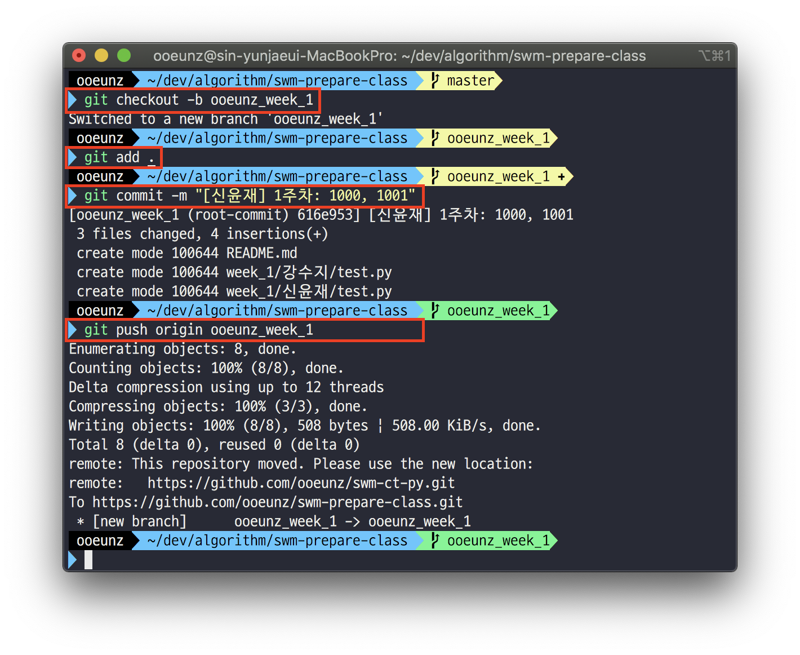
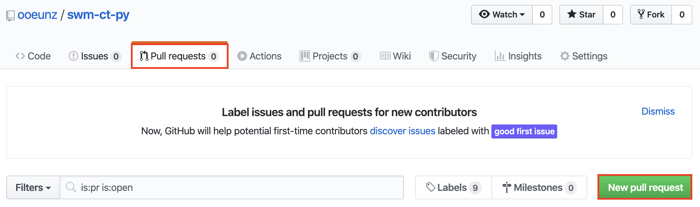
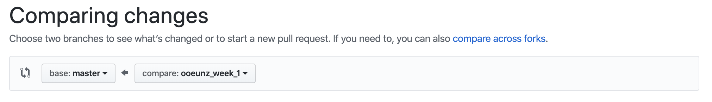
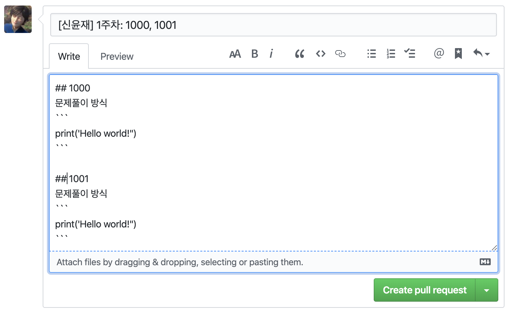
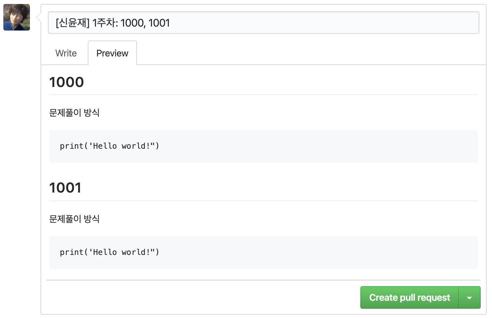

# Repository using rule

- 한주 동안 푼 문제들을 `본인의깃헙아이디` 브랜치로 커밋합니다.

- `본인의깃헙아이디` 디렉토리에 소스코드를 올립니다.

- 브랜치 최신화
  `git pull origin master` // master에 있는 수정사항을 내려받아 현재 branch가 최신 상태를 유지할 수 있도록 합니다.

- 본인의 저장소에 fork 를 떠서 repository 최신으로 동기화하는 경우, [Fork 한 repository 최신으로 동기화하기](https://json.postype.com/post/210431) 를 참고 해 주세요.

\
\

# Pull Request

### 1. Branch 생성 및 commit

- `본인의깃헙아이디_week_몇주차` // 저로 예를들면 ooeunz_week_1이 됩니다.

- branch 만드는 방법
  `git checkout -b 브랜치네임` // branch 생성 후 자동으로 해당 branch 변경됩니다. 처음 branch를 생성 할 때 사용합니다.

   

     
   

### 2. Github에서 Pull request 클릭

- `Pull request`로 이동 후 `New pull request` 클릭
- Master가 base로 오도록 한 후 PR

| Pull request이동 -> New pull request | Master가 base로 오도록 설정 |
| :----------------------------------: | :-------------------------: |
|           |  |

\

### 3. Code flow 작성 후 Pull Requst 올리기

- Pull request 네이밍
  `[신윤재] 1주차 : 1000, 10001` // 숫자는 백준 문제번호 입니다.
- PR시 다른 사람이 코드를 읽기 쉽게 `code flow`를 함께 적어주세요.

|            Write            |           Preview           |
| :-------------------------: | :-------------------------: |
|  |  |

\
\

# Participant

1. 신윤재 : [ooeunz](https://github.com/ooeunz)

2. 강수지 : [astnwl321](https://github.com/KangSuzy)
